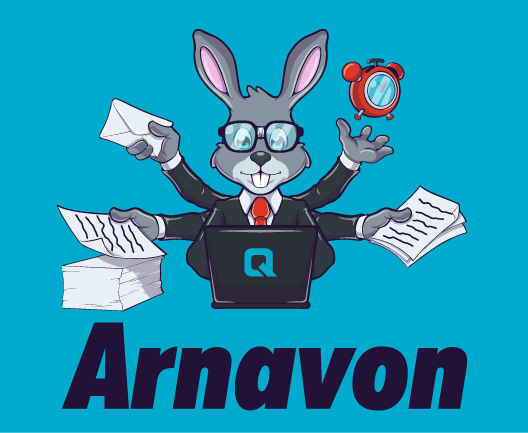

arnavon
===========



Opinionated producer/consumer framework on top of RabbitMQ.

[](https://oclif.io)
[](https://npmjs.org/package/@quadrabee/arnavon)
[](https://travis-ci.com/Quadrabee/arnavon)
[](https://npmjs.org/package/@quadrabee/arnavon)
[](https://github.com/quadrabee/arnavon/blob/master/package.json)

<!-- toc -->
* [Usage](#usage)
* [Commands](#commands)
<!-- tocstop -->
# Usage
<!-- usage -->
```sh-session
$ npm install -g @quadrabee/arnavon
$ arnavon COMMAND
running command...
$ arnavon (--version)
@quadrabee/arnavon/1.0.0-rc.1 darwin-x64 node-v14.21.3
$ arnavon --help [COMMAND]
USAGE
  $ arnavon COMMAND
...
```
<!-- usagestop -->
# Commands
<!-- commands -->
* [`arnavon start`](#arnavon-start)
* [`arnavon start:api`](#arnavon-startapi)
* [`arnavon start:consumer [NAME]`](#arnavon-startconsumer-name)

## `arnavon start`

Starts an arnavon component

```
USAGE
  $ arnavon start
```

## `arnavon start:api`

The REST API provides ways to push Jobs to queues, with validation

```
USAGE
  $ arnavon start:api [-c <value>] [-p <value>]

FLAGS
  -c, --config=<value>  [default: config.yaml] location of config file (defaults to 'config.yaml').
  -p, --port=<value>    Port to use for API (default 3000)
```

## `arnavon start:consumer [NAME]`

Starts an Arnavon consumer

```
USAGE
  $ arnavon start:consumer [NAME] [-c <value>] [-x <value> -a] [-p <value>]

ARGUMENTS
  NAME  The name of the consumer to start

FLAGS
  -a, --all                Start all consumers instead of just one (not recommended, but can be useful in dev)
  -c, --config=<value>     [default: config.yaml] location of config file (defaults to 'config.yaml').
  -p, --port=<value>       Port to use for API (default 3000)
  -x, --except=<value>...  Specify a consumer that should not be started. (Requires -a/--all. Can be used multiple
                           times)
```
<!-- commandsstop -->
